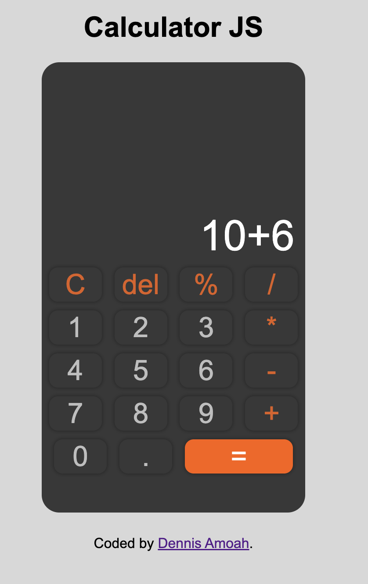

# calculator-js

This is a simple calculator application built using JavaScript, CSS3, and HTML5.

## Features
- Addition, subtraction, multiplication, and division operations
- Clear button to reset the calculator
- Keyboard support for numbers and operators
- Responsive design for various screen sizes

## Technologies Used
- HTML5: Provides the structure of the calculator interface.
- CSS3: Defines the styles and layout of the calculator.
- JavaScript: Implements the calculator's logic and functionality.

## Usage
You can access and use the calculator directly through the following URL: [https://damoah2.github.io/calculator-js/](https://damoah2.github.io/calculator-js/).

Alternatively, if you prefer to run the calculator locally on your machine, follow these steps:

1. Clone the repository or download the source code files.
2. Open the `index.html` file in a web browser.
3. Use the buttons or the keyboard to perform calculations.
4. Click the "Clear" button to reset the calculator.

Remember to replace the URL with your actual deployed calculator's URL if it's different. Good luck!

## Screenshots

## Contributing
Contributions are welcome! If you have any suggestions or improvements, feel free to submit a pull request.

## License
This project is licensed under the [MIT License](LICENSE).

## Acknowledgments
The calculator design and functionality were inspired by various online resources and tutorials.

